# Near-range modulation of single-atomic Fe sites by simultaneously integrating heteroatom and nanocluster for efficient oxygen reduction

Chunfeng Shao a,b, Jiahui Hua b, Qiang Li b, Yongpeng Xia c, Lixian Sun c, Liming Wang a, Baitao Li a,\*

a Guangdong Provincial Key Laboratory of Fuel Cell Technology, School of Chemistry and Chemical Engineering, South China University of Technology, Guangzhou 510640, China   
b Anhui Province Key Laboratory of Pollutant Sensitive Materials and Environmental Remediation, Department of Materials Science and Engineering, Huaibei Normal University, Huaibei 235000, China   
Guangxi Key Laboratory of Information Materials, Guilin University of Electronic Technology, Guilin 541004, China

# ARTICLEINFO

Keywords:

Single-atom catalysts

Oxygen reduction reaction

Iron-nitrogen carbon

Iron atomic cluster

Zn-air battery

Microbial fuel cell

# ABSTRACT

Modulation strategies are widely developed to regulate electronic state of single-atom catalysts (SACs) to reinforce the catalytic activity of oxygen reduction reaction (ORR). However, the modulation effect using only single coordination regulation is often insufficient to optimize the electronic and geometric structure of metal active centers. Herein, a general strategy to modify the activity of single-atomic Fe site is achieved by dual decoration of Fe centers with contiguous sulfur atoms and metal nanoclusters via an aggregation-redispersion route. Under near-range engagement, the adjacent S atoms and Fe nanoclusters can break the symmetric electronic interface of Fe-N moiety, and act as the modulators to synergistically tune the electronic configurations of Fe centers, leading to less electron transfer to $*\mathrm{OH}$ , and subsequent favorable desorption. In situ spectroscopic characterization and theoretical results reinforces the significant roles of S atoms and metal clusters in tandem by correlating their induced electron redistribution with ORR activity, which ultimately accelerates the adsorption/desorption of oxygenated intermediates for robust catalytic performance. Due to the improvement of graphitization degree, carbon supports possess efficient active sites and exhibit superior anti-corrosion. The resultant FeNC-2 M demonstrates outstanding ORR activity with high power density, maintaining remarkable durability in Zn-air batteries and microbial fuel cells. This work provides effective and universal way to modulate microenvironment of single metal sites, facilitating the open up of potential application spaces for various SACs.

# 1. Introduction

The oxygen reduction reaction (ORR) directly determines the energy conversion efficiency of metal-air batteries and fuel cells [1,2]. The appropriate adsorption/desorption of the intermediates is vital for these devices to expedite the kinetics of ORR [3]. Despite the extraordinary catalytic activity of platinum (Pt) group metal [4,5], the high price and slightly inferior durability have stimulated the exploration of efficient non-Pt catalysts. So far, carbon supported single-atom catalysts (SACs), which are composed of isolated metal-nitrogen coordinated active sites anchored on carbon matrixes (M-N-C, M=Fe, Co, Mn, Cu etc.), exhibit outstanding ORR performance due to maximum atomic utilization efficiency and controllable metal coordination environment [6,7]. Especially, as the most promising and cost-effective substitute to commercial

Pt-based catalysts, the Fe-N-C catalysts containing highly symmetrical $\mathrm{Fe - N_4}$ units are highly anticipated [8-10]. Nevertheless, based on previous studies [11,12], the symmetric electronic distribution of $\mathrm{Fe - N_4}$ would cause non-optimal adsorption of ORR intermediates, ultimately impeding the catalytic process. Therefore, the ORR activity of Fe-N-C catalysts still needs to be ameliorated by rationally adjusting the electronic structure of active sites for practical applications.

Until recently, several strategies are developed to modify the electronic structure of isolated metal centers for tailoring the binding strength of oxygen intermediates, thus narrowing energy barriers and boosting the ORR performance [8,13,14]. Specifically, tremendous attentions have been sparked focusing on the interaction of between atomic metal centers and supports or heteroatoms [9,15,16], such as doping alien atoms in the ambient carbon support of $\mathrm{M - N_4}$ moieties

[17], establishing direct engagement between metal and heteroatoms [12,18] and so on. Notably, as the near-range interactions, the latter modification is better but difficult, that is, in pristine $\mathrm{M - N_4}$ sites, some N atoms are partially substituted with heteroatoms (e.g., S [19,20], P [12, 18,21], and C [22]), or the metal center adsorbs ligands (e.g., OH [23], I, Br, and Cl [17]), forming asymmetric atomic interface that directly regulate the adjacent chemical environment of metal atoms.

Nevertheless, mono-metal centers with structural simplicity have high electrocatalytic activity for elementary reactions but may be difficult to efficiently drive the reactions involving multiple sequential proton-electron transfer process [24]. Recently, coupling $\mathrm{M - N_x}$ site with other adjacent metal centers or metallic nanoclusters also have been demonstrated as a feasible strategy to expedite the electrocatalytic activity of M-N-C catalyst [25-27]. Present-day achievements indicate that the heteronuclear coordination can modify the $d$ states of the metal atom, resulting in the optimized adsorption/desorption feature, owing to the synergy between the dual-nuclear metal pairs and the asymmetrical electron distribution around the binuclear metal centers [28-30]. As such, the multinuclear sites, particularly atomic clusters, are highly effective in adjusting the single-atom intrinsic catalytic activity [31,32]. Elaborately controlling nanocluster qualities (such as spatial distribution [33], particle size [26] and composition [34,35]) can induce the electron redistribution of metal atom to narrow the potential barriers of the rate-limiting steps for ORR, resulting in an improved catalytic behavior. However, due to the well-documented thermodynamic instability, metal nanoclusters are prone to grow into larger crystallites during pyrolysis, attributing to the rapidly increased surface energy with the diminution of particle size [13,36]. Additionally, a specific single coordination regulation strategy is often not sufficient to perfectly optimize the electronic and geometric structure of $\mathrm{M - N_4}$ center. It is envisaged that modulating the coordination environment of metal sites

by simultaneously introducing heteroatoms and metallic nanoclusters into M-N-C catalyst, especially the near-range engagement, may be a great promising pathway to further ameliorate the catalytic activity. However, achieving precise regulation remains a significant challenge.

Herein, exceptional single-atomic Fe site boosted by adjacent S atoms and metal nanoclusters is constructed for ORR. As a well-designed near-range coordination structure, the S atoms and Fe nanoclusters as modulators can rationally control the asymmetric interface configuration of central Fe atoms. Theoretical calculation and experimental results verifies that the neighboring modulators synergistically induce electron redistribution between the Fe center sites and the carbon support, thus accelerating the dynamic coupling of oxygen species and the desorption of $\mathrm{OH^{*}}$ for improving ORR activity. Furthermore, the as-prepared FeNC-2 M with optimized template dosage possesses highly graphitized structure and well-developed hierarchical porosity which are capable of reinforcing the device durability and mass transport. As a result, FeNC-2 M exhibits impressive ORR activity with a half-wave potential $(E_{1 / 2})$ of $0.897\mathrm{V}$ . Moreover, the FeNC-2 M-based Zn-air batteries (ZABs) and microbial fuel cells (MFCs) show remarkable power density $(326~\mathrm{mWcm}^{-2}$ and $2790~\mathrm{mW~m}^{-2}$ , respectively), and while maintaining excellent durability with only $\sim 1.48\%$ voltage drop for ZABs over $139\mathrm{h}$ and $\sim 10.9\%$ for MFCs over $2354\mathrm{h}$ .

# 2. Results and discussion

Fig. 1a schematically depicts the synthesis process of FeNC catalysts. The first step was to assemble a hybrid hydrogel of thiosemicarbazide, agarose, $\mathrm{Fe(acac)_3}$ , and in-situ formed $\mathrm{Mg(OH)_2}$ precipitate. After freeze-drying, the dried gels with cyano-containing species were formed and pyrolyzed to decompose $\mathrm{Mg(OH)_2}$ and reconstruct KCl [14], while simultaneously precursors were carbonized to generate Prussian blue

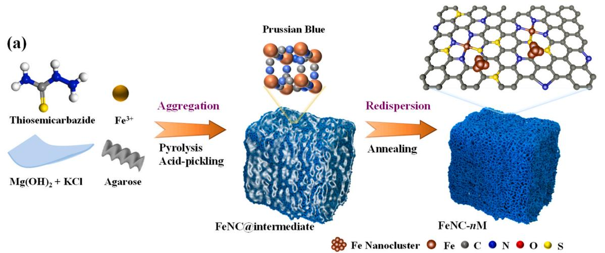

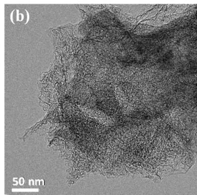

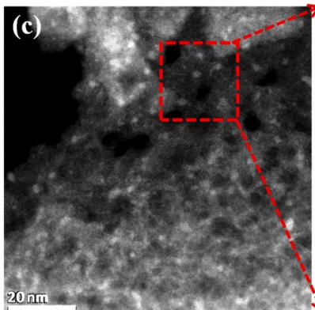

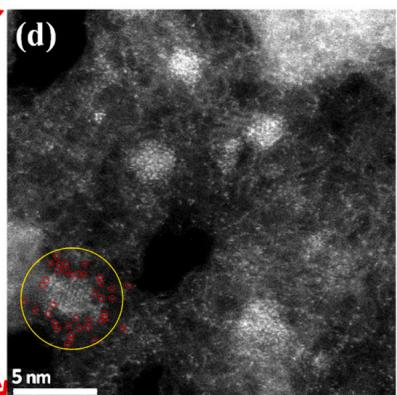  
Fig. 1. (a) Schematic diagram of the synthesis process of FeNC- $n\mathrm{M}$ catalysts. (b) TEM image and (c, d) AC-HAADF-STEM images of FeNC-2 M catalyst.

$(\mathrm{Fe}_4[\mathrm{Fe}(\mathrm{CN})_6]_3)$ anchored porous carbon on the fabricated $\mathrm{MgO}$ and KCl templates (noted as FeNC@template). Subsequently, these templates and excessive Prussian blue aggregation were removed during the acid leaching process to obtain FeNC@intermediate. In the following pyrolysis step, the residual iron species in FeNC@intermediate were redispersed and stabilized by abundant N and S atoms derived from thiosemicarbazide, which further formed $\mathrm{Fe - N_x}$ species decorated with S functional groups and Fe nanoclusters. Eventually, the Fe species dispersing in the N, S-doped hierarchical porous carbon was achieved. To elucidate the role of Mg-based templates, the FeNC@template solid composites with different template contents were investigated, leading to FeNC- $n\mathrm{M}$ electrocatalysts ( $n = 1-3$ , $n$ represent for the amount of $\mathrm{MgCl}_2\cdot 6\mathrm{H}_2\mathrm{O}$ and KOH) (Table S1). Furthermore, a series of FeNC-2 M- $m\mathrm{H}$ electrocatalysts (Table S1) also were prepared by adjusting the concentrations of $\mathrm{H}_2\mathrm{SO}_4$ during the acid leaching process for decomposing the Prussian blue under varying levels. All experimental details are presented in the Supporting Information.

FeNC catalysts and corresponding intermediate were investigated using powder X-ray diffraction patterns. The sharp diffraction peaks belonging to Prussian blue $\mathrm{(Fe_4[Fe(CN)_6]_3)}$ were determined in FeNC-2 M intermediate after acid leaching (Fig. S1a), while completely disappeared after subsequent annealing and was replaced by two characteristic (002) and (100) diffractions planes of the standard carbon for FeNC-2 M (Fig. 2a), suggesting the successful transformation from Prussian blue to monodispersed Fe sites or tiny clusters. Notably, the

XRD patterns (Fig. 2a) revealed that the peak of graphite phase significantly increased with the amount of $\mathrm{Mg(OH)_2}$ and KCl template rising from 1 to 3, indicative of an enhanced graphitization degree. The in-situ formed MgO templates were vital to effective graphitization of precursor and the generation of abundant pore structure[14,37]. However, in FeNC-3 M (Fig. 2a), some well-defined diffraction peaks attributed to FeS were observed as the result of the agglomeration of Fe species under the higher content of templates. Furthermore, XRD results of FeNC-2 M-mH (Fig. S1b) demonstrated that the more concentrated acid during the pickling could enhance the decomposition of Prussian blue, thus leading to higher dispersed Fe species from $\mathrm{Fe}_3\mathrm{C} / \mathrm{Fe}$ nanoparticles (FeNC-2 M-0.25 H) to tiny clusters or single sites (FeNC-2 M-2 H).

The scanning electron microscopy (SEM) image of FeNC-2 M (Fig. S2b) presented a fluffy flake-like morphology with plentiful macropores. At low template dosage, the morphology was converted to honeycomb-like porous architecture in FeNC-1 M (Fig. S2a); while under a high dosage (Fig. S2c), because of excessive decomposition of the carbon matrix, FeNC-3 M suffered from agglomeration, forming the aggregation of Fe and S, as evidenced by the energy-dispersive spectroscopy (EDS) mapping (Fig. S3), which was consistent with the XRD result (Fig. 2a). Transmission electron microscopy (TEM) image of FeNC-2 M (Fig. 1b) clearly demonstrated the interconnected porous frameworks with plenty of mesopores and micropores, suggesting the existence of numerous structure defects in graphite carbon. Simultaneously, the TEM image (Fig. 1b) also excluded the presence of Fe-based

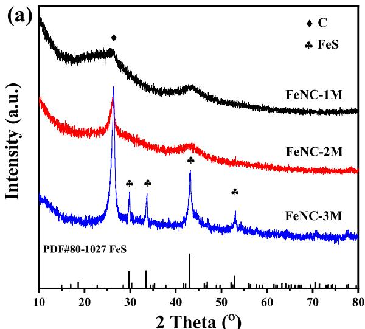

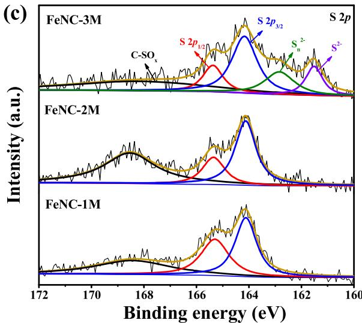

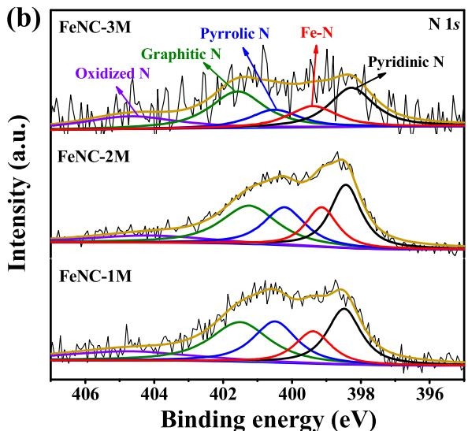

  
Fig. 2. (a) XRD patterns, high-resolution (b) N 1 s and (c) S 2p spectra, and (d) Raman spectra of FeNC- $n$ M catalysts.

large particles. More information came from aberration-corrected high-angle annular dark-field scanning TEM (AC-HAADF-STEM) measurements. The AC-HAADF-STEM image (Fig. 1c) of FeNC-2 M catalyst showed that numerous bright spots with size in the range of $1.4 - 3.1\mathrm{nm}$ (mean size, $2.1\mathrm{nm}$ , Fig. S4a) homogeneously distributed across the whole carbon skeleton, without any large particles or nanocluster aggregates, corresponding to Fe nanoclusters evidenced by the EDS mapping (Fig. S5). Meanwhile, besides the nanoclusters, there were also plentiful well-dispersed bright dots (Fig. 1d), part of them (such as red rings) were closely adjacent to Fe nanoclusters (such as yellow rings). Such a local coordination environment would give rise to a near-range interaction between metal single atoms and the nanocluster.

As observed in EDS mappings (Fig. S5), apart from the Fe element, C, N, S, and O elements of FeNC-2 M catalyst are homogenously distributed throughout the entire porous architecture. However, as displayed in Fig. S6, there was a certain amount of Fe nanoparticles encapsulated in graphitic carbon layers in FeNC-2 M-0.5 H, which was consistent with XRD measurement, indicating that low concentration of acid was insufficient to decompose the iron species, leading to serious Fe agglomeration. In addition, the AC-HAADF-STEM image (Fig. S4b, c) of FeNC-2 M-2 H catalyst was analogous to the that of FeNC-2 M catalyst, except for a slight reduction in the density of Fe clusters, indicating the stability of iron species and the repeatability of this structure. In summary, thiosemicarbazide and Fe ion could coordinate to form the compound containing cyano species, which were carbonized to generate Prussian blue anchored porous carbon. The content and crystallinity of Prussian blue could be effectively controlled by adjusting the amount of Mg-based template and the concentration of $\mathrm{H}_2\mathrm{SO}_4$ during pickling. After secondary carbonization, the Prussian blue group would decompose and redisperse on the heteroatom-doped carbon materials. A small amount of Prussian blue would form monodispersed Fe sites or tiny clusters, and when the Prussian blue loading is high, metal Fe or FeS particles would be formed.

The surface chemical state of FeNC- $n\mathrm{M}$ catalysts was analyzed by Xray photoelectron spectroscopy (XPS). The XPS survey spectra (Fig. S7a) portrayed the existence of C, N, O, S, and Fe in all three catalysts, and corresponding elements content were presented in Table S2. The content of N was determined to be 5.36 at $\%$ for FeNC-2 M, which was higher than those of FeNC-1 M (3.82 at $\%$ ) and FeNC-3 M (1.54 at $\%$ ), suggesting that proper amount of MgO and KCl templates significantly promoted the content of N, due to their catalysis and decomposition on the carbon materials. The high-resolution N 1 s XPS spectra (Fig. 2b) displayed the existence of five types of N species, including pyridinic N ( $\sim 398.2\mathrm{eV}$ ), Fe-N ( $\sim 399.2\mathrm{eV}$ ), pyrrolic N ( $\sim 400.5\mathrm{eV}$ ), graphitic N ( $\sim 401.6\mathrm{eV}$ ), and oxidized N ( $\sim 404.6\mathrm{eV}$ )[38]. The relative ratios and atomic contents of N species calculated according to the integrated peak areas were displayed in Fig. S7c and Fig. S7d. Specifically, the fitting parameters suggested that the pyridinic N and graphitic N were predominant in all catalysts, and their atomic content in FeNC-2 M was the highest, reaching 1.35 and 1.49 at $\%$ , respectively. These N species were beneficial to significantly promoting the catalytic activity for ORR. The high-resolution S 2p spectra (Fig. 2c) of FeNC- $n\mathrm{M}$ showed two peaks located at about 164.1 and $165.3\mathrm{eV}$ assigning to S $2p_{3/2}$ and S $2p_{1/2}$ peaks of S species (thiophene-like S), and another peak at around $168.5\mathrm{eV}$ belonging to oxidized S. Notable differences were observed in the S 2p spectra of FeNC-3 M with two obvious peaks at $\sim 161.5$ and $\sim 162.9\mathrm{eV}$ , corresponding to $S_{\mathrm{n}}^{2-}$ and $S^{2-}$ species. This was attributed to the formation of metal sulfide, consistent with the observation from XRD results (Fig. 2a). The total S content (Table S2) of FeNC- $n\mathrm{M}$ exhibited a tendency to decrease with the rising of templates dosage, while the Fe content increased. It is notable that FeNC-2 M exhibited the highest atomic content of oxidized S of $0.30\mathrm{wt\%}$ among all catalysts, occupying $46.6\%$ of total S content (Fig. S7c and Fig. S7d). These sulfur-dopants, especially the oxidized S, can contribute to the redistribution of surface electron on Fe-N sites, thus facilitating their interaction with oxygenated species and then enhancing the ORR kinetics[14,39]. In

addition, the Fe $2p$ XPS spectrum of FeNC-2 M (Fig. S7b) revealed that the Fe species mainly existed in its oxidation states, and signal for metallic Fe was not obvious. According to inductively coupled plasma optical emission spectrometry (ICP-OES) results (Table S2), the content of Fe for FeNC-2 M was as high as 3.19 at $\%$ , suggesting the existence of dense Fe species in the carbon framework.

The Raman spectra of FeNC- $n\mathrm{M}$ (Fig. 2d) showed two strong peaks of 1346 and $1590~\mathrm{cm}^{-1}$ , attributable to defects (D band) and in-plane vibration of $\mathfrak{sp}^2$ -carbon atoms (G band), respectively[40-42]. The relatively high D band peak further confirm plenty of defects and holes in the carbon matrix and these defects can behave as possible active sites for electrocatalytic reduction. The calculated $I_{\mathrm{D}} / I_{\mathrm{G}}$ value of FeNC-2 M is 1.10, slightly higher than that of FeNC-1 M (1.06) and FeNC-3 M (1.07), illustrating that the moderate template content can promote the formation of more defect sites due to the decomposition/recombination of C/N/S sources under the catalysis of in situ MgO and KCl template. Besides, split twin peaks at about 2683 and $2938~\mathrm{cm}^{-1}$ for FeNC-3 M (Fig. 2d) corresponded to 2D band and $\mathrm{D + D'}$ band[43], which was the typical symbol of graphitic carbon. Combining the Raman study with XRD results, it can be concluded that the characteristic of graphite carbon with a significant defective structure was presented in FeNC-2 M and FeNC-3 M catalysts.

To gain deep insights into the chemical state and coordination information of Fe center in FeNC-2 M, X-ray absorption spectroscopy (XAS) analyses were conducted, including the near-edge (XANES) and extended energy (EXAFS) regions. For comparison, analyses were also performed on the corresponding reference catalysts, such as Fe-foil, $\mathrm{Fe_2O_3}$ , iron phthalocyanine (FePc), and $\mathrm{FeS}_2$ . The Fe K-edge XANES spectra (Fig. 3a) showed the edge position of FeNC-2 M was between $\mathrm{FeS}_2$ and $\mathrm{Fe_2O_3}$ , demonstrating the average valence state of Fe was between the Fe(II) and Fe(III) states and close to Fe(II) state. The Fourier transform (FT) EXAFS spectra of FeNC-2 M and the references were illustrated in Fig. 3b. The FeNC-2 M exhibited a prominent FT peak at about $1.4\AA$ , which was mainly attributed to the Fe-N/O first coordination shell and close to that in the reference FePc ( $\sim1.5\AA$ ). Furthermore, there were a small shoulder peak at $1.85\AA$ and an obvious peak at $2.3\AA$ , arising from Fe-S and Fe-Fe scattering paths, respectively, and revealing the co-existence of Fe-N(O/S) $_x$ species and metallic Fe[20,26, 31]. Wavelet transform (WT) also was applied to discriminate the backscattering atoms, owing to the powerful resolution in both $k$ and $R$ spaces. As shown in Fig. 3c, WT analysis of FeNC-2 M revealed an intensity maximum at low k value ( $\sim3.3\AA^{-1}$ ). Besides, distinct from those (Fig. S8a) of $\mathrm{Fe_2O_3}$ ( $\sim7.5\AA^{-1}$ ) and Fe-foil ( $\sim7.6\AA^{-1}$ ), the contour plots of FeNC-2 M showed an additional smaller peak at high k value ( $\sim7\AA^{-1}$ ) as a ridge that could be assigned to Fe-Fe scattering. Taking into account the results presented in XRD and HAADF-STEM studies, it can be assumed that Fe in FeNC-2 M existed primarily as highly monodispersed atoms, but also as many tiny nanoclusters. Quantitatively, the structural parameters at Fe K-edge were extracted by a least-square EXAFS fitting in $R$ , $q$ , and $k$ spaces. Based on the results (Fig. 3d, e, Fig. S8c, and Table S3), the first coordination shell around Fe for FeNC-2 M was constructed (the inset of Fig. 3d). It demonstrated the presence of both Fe-N and Fe-S, with coordination numbers of 3 and 1, respectively. Their respective mean bond length were 1.94 and $2.33\AA$ , close to the fitting result of FePc and the theoretical value of $\mathrm{FeS}_2$ , further evidencing the Fe- $\mathrm{N}_3\mathrm{S}$ coordination structure in this catalyst. Meanwhile, there also existed an absorbed O atom on the axial direction of Fe- $\mathrm{N}_3\mathrm{S}$ plane. The oxygen may be adsorbed in the form of $\mathrm{O}_2$ , due to the exposure of the catalyst to air. Moreover, a small contribution from the Fe-Fe scattering path relative to Fe nanoclusters was determined, illustrating that minimum amount of Fe species were present in metallic clusters form. For comparison, the first shell of Fe center in FePc (Fig. S8b, d) exhibited a coordination number of four, directly connected by four N atoms. According to the EXAFS fitting and TEM results, the Fe atoms coordinated with three N atoms and one S atom, and the $\mathrm{Fe - N_3S}$ species were anchored in N-doped carbon with Fe nanoclusters.

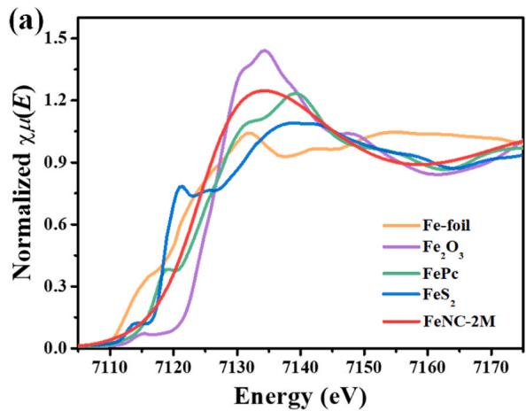

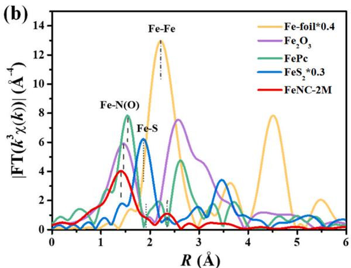

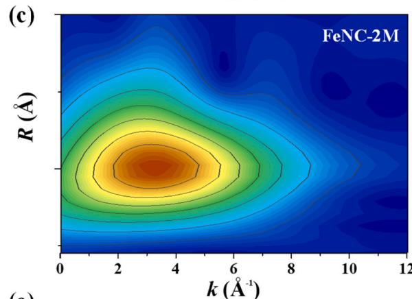

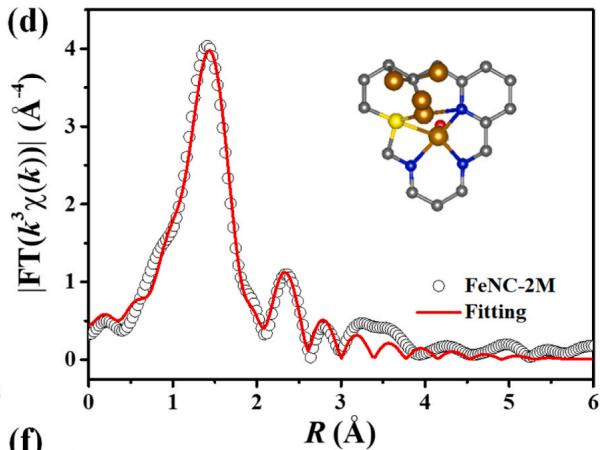

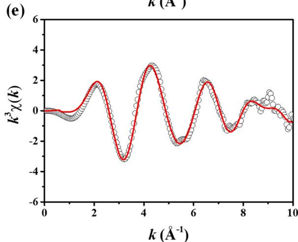

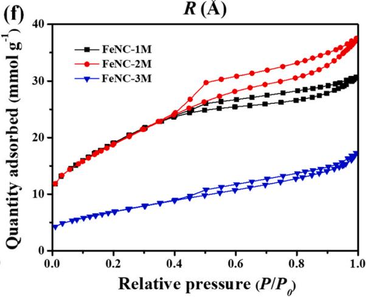  
Fig. 3. (a) Fe K-edge XANES and (b) FT $\mathrm{k}^3$ -weighted EXAFS spectra of FeNC-2 M catalyst and the reference samples Fe-foil, $\mathrm{Fe}_2\mathrm{O}_3$ , $\mathrm{FePc}$ , and $\mathrm{FeS}_2$ . (c) WT-EXAFS spectra of FeNC-2 M. The corresponding FT-EXAFS fitting curve of FeNC-2 M in (d) $R$ -space and (e) $k$ -space. Inset: the schematic atomic model of FeNC-2 M, C (gray), N (blue), O (red), S (yellow) and Fe (brown). We executed EXAFS curve fitting on the first coordination shell of Fe centers by considering two backscattering paths (including Fe-N and Fe-S), where Fe-Fe bonds also exist in FeNC-2 M catalyst. (f) $\mathbf{N}_2$ adsorption/desorption isotherms of FeNC- $n\mathbf{M}$ catalysts.

Therefore, under the near-range engagement, the adjacent S atoms and Fe nanoclusters could act as the modulators to affect the activity of the Fe centers.

The porosity characteristics of the porous carbon were further analyzed using nitrogen physisorption measurements (Table S2). Apparently, FeNC-2 M showed a high specific surface area (SSA) of $1502\mathrm{m}^2\mathrm{g}^{-1}$ with a pore volume of $1.23\mathrm{cm}^3\mathrm{g}^{-1}$ , which were significantly larger than those of FeNC-3 M $(554\mathrm{m}^2\mathrm{g}^{-1}$ and $0.56\mathrm{cm}^3\mathrm{g}^{-1})$ and similar to those of FeNC-1 M $(1517\mathrm{m}^2\mathrm{g}^{-1}$ and $1.04\mathrm{cm}^3\mathrm{g}^{-1})$ . The isotherms and pore size distribution (PSD) (Fig. 3f and S7e) illustrated the critical influence of the amount of MgO and KCl template on the pore structure. As shown in Fig. 3f, the type-IV isotherms with characteristic H3 hysteresis loop at higher pressure confirmed the hierarchically

porous superstructure of FeNC- $n$ M catalysts. The steep $\mathrm{N}_2$ uptake at low relative pressure $(P / P_0)$ and gentle uptake at high $P / P_0$ for FeNC- $n$ M indicated the coexistence of abundant micropores and mesopores. Thereinto, the amount of adsorption at $P / P_0$ below 0.40 was almost equal for FeNC-1 M and FeNC-2 M, while the hysteresis loop of FeNC-2 M was obviously larger than that of FeNC-1 M, attributing to more well-developed mesoporosity for FeNC-2 M. Specifically, by elevating the MgO and KCl content, the average pore diameter (APD) of FeNC- $n$ M gradually increased from 2.73 (FeNC-1 M) to 3.28 (FeNC-2 M) and 4.01 nm (FeNC-3 M). These results indicated that high template content could favor the formation of mesopores, while the porous structure collapsed when the template content was too high, due to numerous metal agglomerations and excessive decomposition of the carbon

skeleton. These porosity characteristics were also verified in the PSD (Fig. S7e) and SEM images (Fig. S2). The in situ porous MgO and KCl were an efficient substrate to promote the decomposition and reconstitution of N/S-containing carbon precursors, thus resulting in the hierarchical porous graphene layers with conductive and stable framework [14].

The ORR performance of the designed catalysts was comprehensively assessed in a broad pH range by employing various techniques. These ORR activity parameters obtained from ring-disk electrode (RDE) tests were summarized in Table S4. To our delight, in the linear sweep voltammogram (LSV) curves, FeNC-2 M exhibited superior electrocatalytic activity in terms of high half-wave potential and kinetic current density $(E_{1/2}, 0.897\mathrm{~V}; J_{\mathrm{k}}@0.85\mathrm{~V}, 8.37\mathrm{~mA}\mathrm{~cm}^{-2})$ under alkaline condition (Fig. 4a, 4d and Fig. S9), surpassing that of FeNC-1 M (0.873, 4.60) and FeNC-3 M (0.840, 2.54), and even exceeding that of commercial Pt/C (0.852, 3.41). The corresponding Tafel slope (Fig. 4b) of FeNC-2 M was determined to be $49\mathrm{mVdec}^{-1}$ , which was greatly lower than that of other catalysts $(55\mathrm{mVdec}^{-1}$ for FeNC-1 M, $63\mathrm{mVdec}^{-1}$ for FeNC-3 M, and $78\mathrm{mVdec}^{-1}$ for Pt/C), indicating the fast kinetics for FeNC-2 M. Furthermore, compared with the performance of catalysts treated with different acid concentration, the ORR activity of FeNC-2 M showed obvious advantages over FeNC-2 M-0.25 H and FeNC-2 M-0.5 H catalysts (Fig. 4c, d), indicating the important role of $\mathrm{Fe - N_3S}$ sites

coexisting with plentiful Fe nanoclusters instead of large metal particles. A gap of $15\mathrm{mV}$ in $E_{1 / 2}$ between the FeNC-2 M and FeNC-2 M-2 H catalyst with a relatively small number of Fe nanoclusters revealed the promotion effect of plentiful Fe clusters on the activity of single metal atoms. The catalyst without S and Fe clusters have been reported in previous work with a $E_{1 / 2}$ of only $0.869\mathrm{V}[14]$ , further demonstrating the synergistic effect of Fe cluster and S dopants. In neutral pH (Fig. S9i), FeNC-2 M exhibited an $E_{1 / 2}$ of $0.683\mathrm{V}$ in $0.05\mathrm{M}$ PBS electrolyte, which was about $46\mathrm{mV}$ more positive than that of $\mathrm{Pt} / \mathrm{C}$ catalyst. Furthermore, in acidic pH (Fig. 4e and Table S4), FeNC-2 M also presented respectable ORR performance, including $E_{1 / 2}$ of $0.794\mathrm{V}$ and diffusion-limited current density $(J_{\mathrm{L}})$ of $5.47\mathrm{mAcm}^{-2}(0.5\mathrm{MH}_2\mathrm{SO}_4)$ , and was very close to that of $\mathrm{Pt} / \mathrm{C}$ $(0.819\mathrm{V}$ and $5.14\mathrm{mAcm}^{-2})$ . The electrochemical performance of FeNC-2 M in $\mathsf{pH}$ -universal media was located at a high level compared with reported non-noble metal catalysts (Tables S5).

The catalytic pathways during ORR process were confirmed by monitoring the formation of peroxide species $\mathrm{(HO_2)}$ and the number of electrons transferred per oxygen molecule $(n)$ via the rotating ring-disk electrode (RRDE). From $0.3 - 0.8\mathrm{V}$ (Fig.4f), the $\mathrm{HO}_2^-$ yield of all FeNC-nM catalysts were in the range of $1.04 - 5.65\%$ and $n$ remained at 3.88-3.97, exceeding Pt/C catalyst, among which FeNC-2 M catalyst delivered the lowest $\mathrm{HO}_2^-$ yield (below $3.42\%$ ) and the highest $n$ above 3.93), indicating the ORR catalysis proceeded dominantly via a 4-

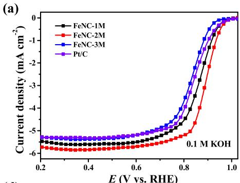

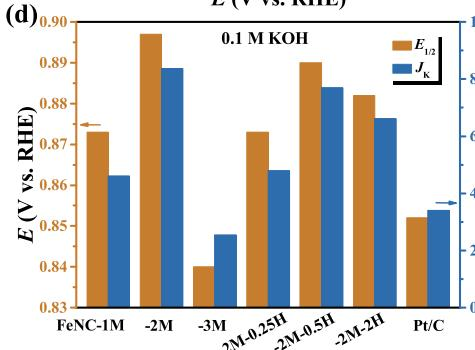

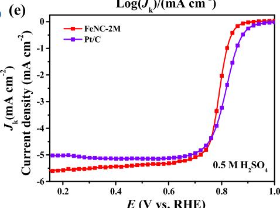

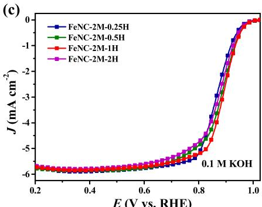

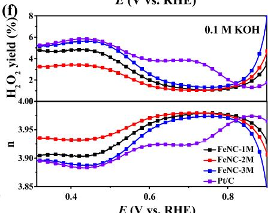

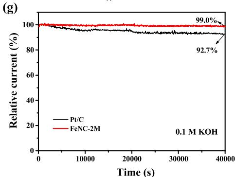

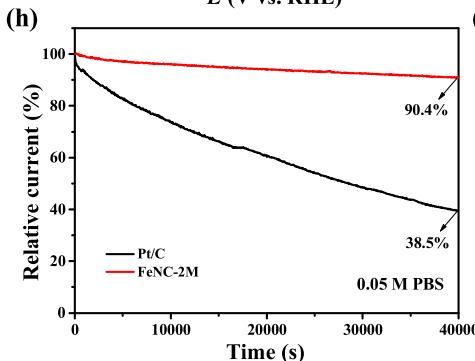

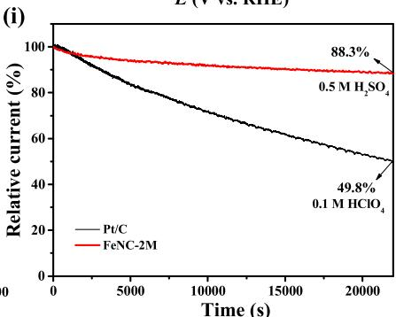  
Fig. 4. (a, c) LSV curves of as-prepared catalysts and Pt/C catalyst recorded at $10\mathrm{mVs^{-1}}$ and 1600 rpm. (b) Tafel slopes of FeNC-nM catalysts. (d) Corresponding halfwave potential $(E_{1 / 2})$ and kinetic current density $(J_{\mathrm{k}})$ at $0.85\mathrm{V}$ of all prepared catalysts. (e) LSV curves of FeNC-2 M in $0.5\mathrm{M}$ $\mathrm{H}_2\mathrm{SO}_4$ and Pt/C in $0.1\mathrm{M}$ $\mathrm{HClO_4}$ electrolyte at $10\mathrm{mVs^{-1}}$ and 1600 rpm. (f) Peroxide yields and electron transfer number of FeNC-nM and Pt/C catalyst in alkaline media. Chronoamperometric response of FeNC-2 M and Pt/C at $0.7\mathrm{V}$ in (g) alkaline, (h) neutral, and (i) acid media.

electron pathway under alkaline condition. Furthermore, the electrochemical surface area (ECSA) is another important factor to elucidate the accessible active area. The ECSA of FeNC- $n$ M catalysts was measured via double-layer capacitance (DL-capacity) according to cyclic voltammetry (CV) curves (Fig. S10). Intriguingly, although SSA of FeNC-2 M was slightly lower than that of FeNC-1 M, FeNC-2 M showed the highest DL-capacity $(64.5\mathrm{mFcm}^{-2})$ among FeNC- $n$ M and Pt/C catalysts, indicating that well-developed mesopores were more conducive to maintaining superb accessibility of active sites, thereby improving their utilization efficiency. In addition, it is worth noting that the ECSA of Pt/C was only one fourth of that of FeNC-3 M (FeNC-3 M: $22.8\mathrm{mFcm}^{-2}$ ,

Pt/C: $5.3\mathrm{mFcm}^{-2}$ ). It indicated that FeNC-3 M catalyst exhibited a more developed porous structure and could expose more active sites. However, as proved by XRD patterns, the exposed active sites were mainly FeS species which were formed as a result of higher content of templates. The worse dispersion and bigger particle size of FeS over the FeNC-3 M carbon surface made its inferior ORR performance to Pt/C.

As an ideal ORR catalyst, much more attention should be devoted to the long-term durability. The potentiostatic stability tests of ORR were performed by using the chronoamperometric measurement in an $\mathrm{O}_2$ saturated alkaline, neutral, and acidic solution under the potential of $0.7\mathrm{V}$ and a rotational speed of $200\mathrm{rpm}$ continuously. As shown in

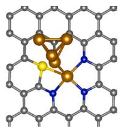  
(a)

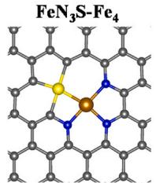  
FeN₃S

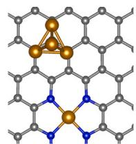

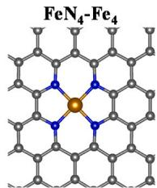  
FeN4

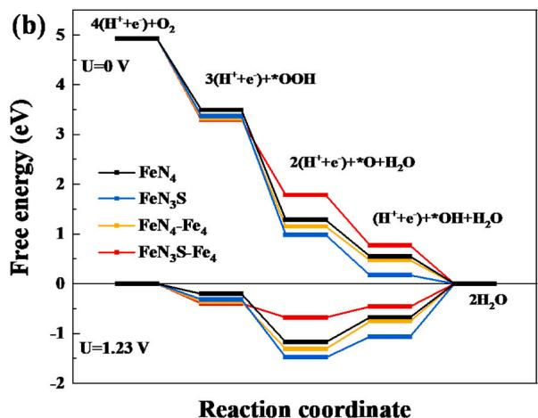  
(b)

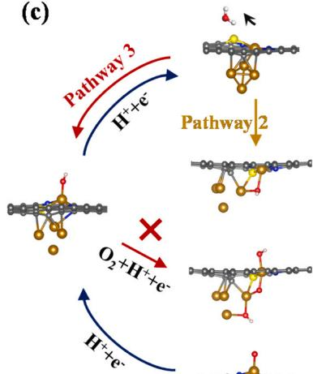  
(c)   
(e)

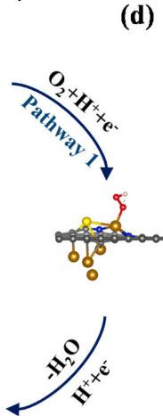  
(d)

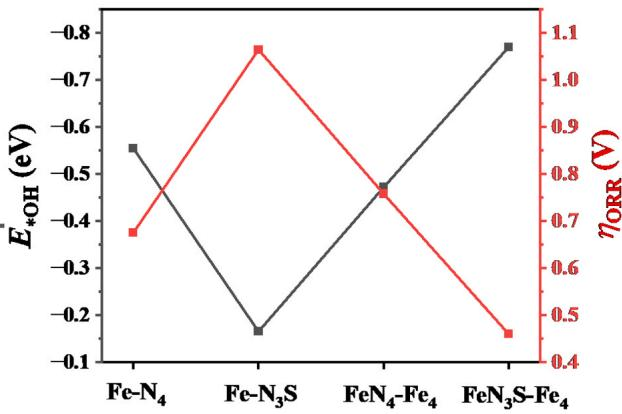  
(f)

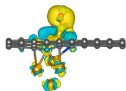  
FeN₃S-Fe₄

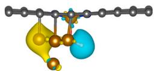  
$\mathbf{F e N}_{4} - \mathbf{F e}_{4}$

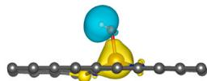  
FeN₃S

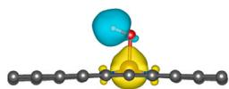  
FeN

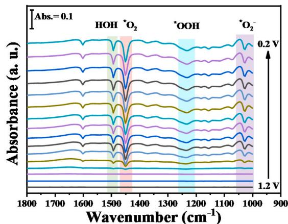  
Fig. 5. Exploring the reinforced intrinsic activity for ORR. (a) Illustration of proposed four models. (b) Gibbs free energy diagrams at 0 and $1.23\mathrm{V}$ on four sites. (c) Overall ORR mechanism on $\mathrm{FeN}_3\mathrm{S - Fe_4}$ model. (d) Comparison of adsorption free energy of ${}^{*}\mathrm{OH}$ on various sites and corresponding overpotential. (e) Calculated charge density differences for various sites. The charge accumulation and depletion were colored in yellow and cyan, respectively. (f) In situ ATR-SEIRAS for FeNC-2 M for ORR at different potentials.

Fig. 4 g, about $99.0\%$ original current density was retained over a period of $40000\mathrm{s}$ in $0.1\mathrm{M}$ KOH for FeNC-2 M, better than that of $\mathrm{Pt / C}$ $(92.7\%)$ . Likewise, compared with the detectable shift for $\mathrm{Pt / C}$ (Fig. S11b), the shift in $E_{\mathrm{onset}}$ and $E_{1/2}$ was ignorable in the LSV curves of FeNC-2 M (Fig. S11a), reflecting its high catalytic stability. To our satisfactory, the FeNC-2 M and Pt/C displayed current drop of $9.6\%$ and $61.5\%$ under neutral media after $40,000\mathrm{s}$ (Fig. 4 h), as well as $11.7\%$ and $50.2\%$ under acidic media (Fig. 4i) after $20,000\mathrm{s}$ , respectively, further evidencing the superiority of the former. Impressively, after undergoing the above stability test, no obvious large metal particles were visible at the TEM images (Fig. S12) of FeNC-2 M, and meanwhile, its developed pore structure could be well maintained, highlighting the superior anticorrosion capability.

In addition, the methanol tolerance of FeNC-2 M was assessed by injecting $20~\mathrm{mL}$ methanol into $0.1\mathrm{M}$ KOH solution. As evidenced in Fig. S13a, a sharp decrease in $\mathrm{Pt / C}$ was discovered upon methanol injection. By contrast, there was negligible decay in the current density for FeNC-2 M catalyst with the introduction of methanol (Fig. S13b,c), reflecting its excellent resistance to methanol crossover. To further ascertain the role of Fe centers (including $\mathrm{Fe - N_3S}$ species and Fe nanoclusters) in the ORR, thiocyanide $(\mathrm{SCN}^{-})$ ions, with high affinity to Fe, were introduced to poison the Fe-based sites [41,44]. Upon the introduction of $\mathrm{SCN}^{-}$ into $0.1\mathrm{M}$ $\mathrm{HClO}_4$ (Fig. S13d), the $E_{1 / 2}$ and $J_{\mathrm{L}}$ of FeNC-2 M decreased significantly by $\sim 60\mathrm{mV}$ and $0.84\mathrm{mAcm}^{-2}$ respectively, manifesting that Fe centers were responsible for the superior ORR performance of FeNC-2 M.

To elucidate the influences of electronic properties and structures on the excellent ORR activities of FeNC-2 M, theoretical study was conducted using density functional theory (DFT) calculations. By comprehensive consideration of XAS and TEM results as well as the results reported in literatures[11,18,20,31,45], five models, namely, $\mathrm{FeN}_3\mathrm{S - Fe_4}$ , $\mathrm{FeN_4 - Fe_4}$ , $\mathrm{FeN_3S}$ , $\mathrm{FeN_4}$ , and $\mathrm{Fe_4}$ (Fig. 5a and Fig. S14) after geometry optimization were constructed to insight into the synergistic effect of Fe cluster and S dopants (i.e., S bonding to metal atom). The ORR mechanism is generally accepted in the following steps, where $\mathrm{O_2}$ is indirectly reduced to $\mathrm{H}_2\mathrm{O}$ through the formation of a peroxy intermediate:

(1) protonation of $\mathrm{O}_2(\Delta \mathrm{G}_1)$ : $\mathrm{O}_2 + 4(\mathrm{H}^+ +\mathrm{e}^-)\rightarrow \mathrm{OOH}^* +3(\mathrm{H}^+ +\mathrm{e}^-)$   
(2) protonation of $\mathrm{OOH^{*}}$ $(\Delta G_{2})$ .. $\mathrm{OOH^{*} + 3(H^{+} + e^{-})\rightarrow O^{*} + H_{2}O + }$ $2(\mathrm{H}^{+} + \mathrm{e}^{-})$   
(3) protonation of $\mathrm{O}^{\ast}$ $(\Delta G_{3})$ .. $\mathrm{O^{*} + H_{2}O + 2(H^{+} + e^{-})\rightarrow OH^{*} + H_{2}O}$ $+\left(\mathrm{H}^{+} + \mathrm{e}^{-}\right)$   
(4) protonation of $\mathrm{OH^{*}}$ (or the ${}^{*}\mathrm{OH}$ desorption) $(\Delta \mathrm{G}_{4})$ .. $\mathrm{OH^{*} + H_{2}O + }$ $(\mathrm{H}^{+} + \mathrm{e}^{-})\rightarrow 2\mathrm{H}_{2}\mathrm{O}.$

The optimized adsorption configurations of ORR intermediates $\mathrm{(^{*}OOH, ^{*}O}$ and ${}^{*}\mathrm{OH}$ Fig.S15-17) and more computational results were given in supporting information. The free energy diagrams (Fig. 5b and Fig. S17a) showed that at $\mathrm{U} = 0\mathrm{V}$ all the electron transfer steps were exothermic $(\Delta G < 0)$ , and at $\mathrm{U} = 1.23\mathrm{V}$ the protonation of ${}^{*}\mathrm{OH}$ for all Fe centers were the most endothermic and therefore the rate-determining step (RDS) toward ORR. By comparing the $\Delta G$ of RDS, it can be observed that the catalytic activity of these electrocatalysts went by the following order: $\mathrm{FeN_3S - Fe_4 > FeN_4 > FeN_4 - Fe_4 > FeN_3S > Fe_4}$ . Numerous studies[20,46-48] have indicated that the $\mathrm{FeN_4}$ site is located at the left side of the Volcano plot, and its strong adsorption, in turn, leads to the difficult desorption of ORR intermediates from the active center and thus a slower ORR kinetics (Fig. 5b). However, compared with $\mathrm{FeN_4}$ , the introduction of S dopants $\mathrm{(FeN_3S)}$ and Fe cluster $\mathrm{(FeN_4 - Fe_4)}$ as well as the independent $\mathrm{Fe_4}$ (Fig. 5b and Fig. S17a) showed stronger adsorption of all ORR intermediates and smaller exothermic for the protonation of ${}^{*}\mathrm{OH}$ $(\mathrm{U} = 0\mathrm{V})$ , confirming lower catalytic activity for ORR. Impressively, $\mathrm{FeN_3S - Fe_4}$ exhibited the biggest ${}^{*}\mathrm{OH}$ adsorption free energy $(-0.77\mathrm{eV},$ Fig. 5d on RDS and the lowest ORR overpotential $(0.46\mathrm{V})$ compared with all control structures, demonstrating the lower reaction energy barrier and superior ORR activities of the $\mathrm{FeN_3S - Fe_4}$ with extra Fe cluster and S dopants synergistic incorporation on Fe

center.

Considering the existence of O-containing ligands and the influence of the ${}^{*}\mathrm{OH}$ desorption (RDS), the $\mathrm{FeN}_3\mathrm{S - Fe_4}$ models with different hydroxyl adsorption (Fig. S18) have been built to systematically investigate the influence of various structural models. When hydroxyl ligand adsorbed on one side of the $\mathrm{Fe_4}$ cluster, the $\mathrm{FeN}_3\mathrm{S - Fe_4}$ -OH-up model (Fig. S18a) was constructed. Its RDS (Fig. S19) turned to be the third electron-transfer step, i.e., the formation of ${}^{*}\mathrm{OH}$ from the protonation of ${}^{*}\mathrm{O}$ (Fig. S20b, c), having a bigger overpotential $(\eta)$ of $0.685\mathrm{V}$ compared with $\mathrm{FeN}_3\mathrm{S - Fe_4}$ model (Fig. S19). The proposed mechanisms of ORR on $\mathrm{FeN}_3\mathrm{S - Fe_4}$ (Pathway 1) and $\mathrm{FeN}_3\mathrm{S - Fe_4}$ -OH-up models (Pathway 2) were depicted in Fig. 5c, S21 and S22, which belonged to the indirect four-electron processes. When hydroxyl ligand adsorbed on the opposite side of the $\mathrm{Fe_4}$ cluster, namely, $\mathrm{FeN}_3\mathrm{S - Fe_4}$ -OH-down model (Fig. S18b), its adsorbed ${}^{*}\mathrm{OOH}$ was decomposed directly to ${}^{*}\mathrm{O}$ and ${}^{*}\mathrm{OH}$ , that is, $\mathrm{OOH}^* \rightarrow \mathrm{O}^* + \mathrm{OH}^*$ (Fig. S19 and S20d) and direct four-electron processes may occur (Pathway 3, Fig. S23), due to the lower barrier of $\mathrm{O}_2$ dissociation. However, the subsequent ${}^{*}\mathrm{OH}$ desorption $(\mathrm{O}^* + \mathrm{OH}^* + 3$ $(\mathrm{H}^{+} + \mathrm{e}^{-}) \rightarrow \mathrm{O}^* + \mathrm{H}_2\mathrm{O} + 2(\mathrm{H}^+ + \mathrm{e}^-)$ , corresponding to step (2)) needed an endothermic reaction energy of $0.879\mathrm{eV}$ , even at $\mathrm{U} = 0\mathrm{V}$ , resulting in a high overpotential. The mechanism of ORR on $\mathrm{FeN}_3\mathrm{S - Fe_4}$ model with or without ${}^{*}\mathrm{OH}$ is summarized in Fig. 5c. The ORR mechanism on $\mathrm{FeN}_3\mathrm{S - Fe_4}$ model could only follow an indirect four-electron processes. Due to an extremely low barrier of $\mathrm{O}_2$ dissociation for Pathway 3 (OH-down model) and bigger overpotential for Pathway 2 (OH-up model), it can be assumed that the clean $\mathrm{FeN}_3\mathrm{S - Fe_4}$ surface without additional ${}^{*}\mathrm{OH}$ adsorption was the true active sites.

To further uncover S dopant and Fe cluster-induced electronic regulation mechanism on Fe-N center, the charge density differences (Fig. 5e and Fig. S24) and Bader charge (Table S6) of four Fe models with adsorbed $*\mathrm{OH}$ as the RDS were directly calculated. The calculation results showed that S atoms on $\mathrm{Fe - N_3S}$ and $\mathrm{FeN}_3\mathrm{S - Fe}_4$ models was inclined to donate electrons to active sites, where the Bader charge of S in $\mathrm{FeN}_3\mathrm{S - Fe}_4$ was $+0.136$ , which was lower than that of $\mathrm{Fe - N_3S(+0.236)}$ . The total electrons on the O and H atoms (Table S6) obtained from the active center by $*\mathrm{OH}$ adsorbed on $\mathrm{FeN}_3\mathrm{S - Fe}_4$ model were significantly reduced compared to the other models, thereby leading to its weakened adsorption and subsequent favorable desorption[49]. Overall, these DFT calculations showed that the introduced Fe cluster and S dopant synergistically modulated the electronic configurations of Fe center to enhance $\mathrm{O}_2$ activation and optimize the adsorption of all oxygenated species, thus contributing to higher ORR activities.

To further investigate the oxygen intermediates during the ORR process, in situ attenuated total reflectance surface-enhanced infrared adsorption spectroscopy (ATR-SEIRAS) was performed for FeNC-2 M electrocatalyst by scanning the applied potential negatively from 1.2 to $0.2\mathrm{V}$ vs RHE. Fig. 5f and Fig. S25 showed that there were no prominent peaks at a potential range from 1.2 to $1.0\mathrm{V}$ , whereas numerous prominent signatures were observed after the voltage exceeded $1.0\mathrm{V}$ , indicating the occurrence of ORR process. Fig. 5f revealed that there were two sharp absorption peaks at 1027 and $1448~\mathrm{cm}^{-1}$ , corresponding to the O-O stretching mode of $\mathrm{O}_2^-$ and $\mathrm{O}_2$ adsorbed on the FeNC-2 M catalyst surface[50-52]. The peak at $1230~\mathrm{cm}^{-1}$ emerged slowly upon decreasing the applied potentials, manifesting the bending mode vibrations of ${}^{*}\mathrm{OOH}[51]$ . As the potentials decreased, the intensity of these peaks was enhanced gradually, implying the dynamic coupling of oxygen species on the catalyst surface[50]. Meanwhile, the obvious signature of ${}^{*}\mathrm{O}_2$ , ${}^{*}\mathrm{O}_2$ , and ${}^{*}\mathrm{OOH}$ also proved that the active sites of FeNC-2 M catalyst was conducive to oxygen adsorption, and the formation of these ORR intermediates was not the RDS toward ORR, coinciding with the DFT calculation results that the protonation processes of $\mathrm{O}_2$ and $\mathrm{OOH}^*$ are spontaneous and prone to occur. Besides these intermediate peaks, there was a broad OH stretching peak (Fig. S25a) arising between 3300 and $3700~\mathrm{cm}^{-1}$ , manifesting the adsorption of water molecules and hydroxyls on the active sites. The peak at $1492~\mathrm{cm}^{-1}$ (Fig. 5f) ascribing to H-O-H bending mode further verified the formation of water

molecules[51,52]. These peaks gradually became intensified with decreasing potential, further confirming the high-efficiency ORR process. Obviously, the active centers in FeNC-2 M could markedly facilitate the dynamic progress of ORR, especially for the formation and cleavage of oxygen intermediates, thus delivering robust ORR performance.

Encouraged by superior ORR performance in half-cell test, Zn-air battery (ZAB) and microbial fuel cell (MFC) were assembled using the FeNC-2 M electrocatalyst as active air electrode. The homemade ZAB using FeNC-2 M as the cathode (FeNC-2 M-ZAB) gave a high open circuit potential (OCP) of $1.52\mathrm{V}$ (Fig. 6a), close to the theoretical value of $1.65\mathrm{V}$ . Two series-connected FeNC-2 M-ZAB could easily lighten the red, yellow, and blue light-emitting diode (LED). As shown in Fig. 6b, an impressive peak power density of $326\mathrm{mWcm}^{-2}$ was achieved in FeNC-2 M-ZAB at a current density of $410\mathrm{mA cm}^{-2}$ , prominently surpassing $\mathrm{Pt / C - ZAB}$ $(243\mathrm{mWcm}^{-2})$ and most of other ZAB previously reported (Table S5). Furthermore, the durability of FeNC-2 M cathode was monitored using galvanostatic discharge measurement at $10\mathrm{mA cm}^{-2}$ . As illustrated in Fig. 6c, the discharge voltage of FeNC-2 M-ZAB was $\sim 1.35\mathrm{V}$ during the first discharge cycle. After replacing the Zn anode and electrolyte periodically, the FeNC-2 M electrode could work stably in the button cell. Most intriguingly, only $\sim 1.48\%$ voltage retention was observed at 3rd cycle for FeNC-2 M-ZAB. Over a period of $139\mathrm{h}$ (Fig. 6c), the discharge voltage of FeNC-2 M-ZAB was obviously larger than that of Pt/C-ZAB. In addition, under different current densities, the voltage plateaus of FeNC-2 M-ZAB (Fig. S26a) also higher than those of

Pt/C-ZAB, especially at high current density (200 and $300\mathrm{mAcm}^{-2}$ ), profiting from the high active sites and efficient mass transfer feature. These results confirmed the excellent activity and durability of FeNC-2 M catalyst for ZAB applications, reflecting the great feasibility as high-efficiency cathode catalyst.

Microbial fuel cell (MFC) is an attractive biotechnology that employs electroactive microbes as biocatalysts to directly harvest energy from wastewater and realizes wastewater treatment[53-55]. To evaluate the application potential of FeNC-2 M catalyst in neutral media, the single-chamber MFC unit with FeNC-2 M as air cathode was assembled, and the reaction process of FeNC-2 M-MFC was shown in Fig. 6d. Thereinto, the anode was the mixed strain from anaerobic domestic effluent to better simulate the actual environment. The different cathode catalysts were separately installed into the same MFC device overgrown with electricigens for minimizing the impact of anodic microorganisms on power output (Fig. S26b). The polarization curves and power density curves of FeNC-2 M-MFC and Pt/C-MFC were recorded under the external resistance from 33000-51 $\Omega$ , as depicted in Fig. 6e. The FeNC-2 M-MFC obtained a maximum power density of $2790\mathrm{mW}\mathrm{m}^{-2}$ , once again demonstrating enormous advantages over the MFC driven by Pt/C $(2036\mathrm{mWcm}^{-2})$ and other non-precious ORR catalysts reported previously (Table S5).

The stability of MFCs was assessed by monitoring the voltage output over $2354\mathrm{h}$ across an external resistance of $1000\Omega$ (Fig. 6g). During the preliminary stage of MFCs operation, the voltages of all MFC devices were unstable, and no voltage platform appeared. This could be

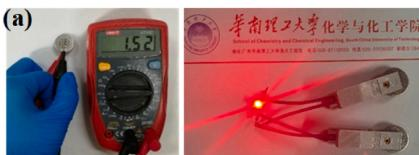

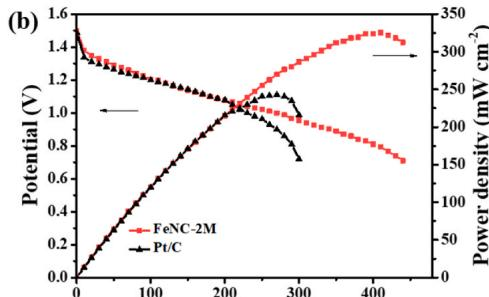

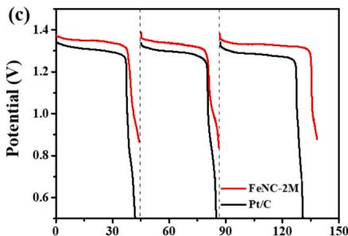

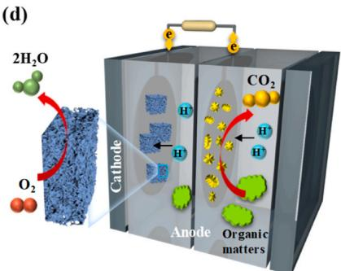

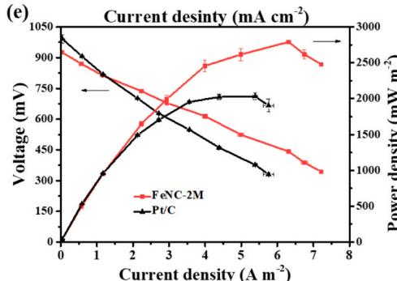

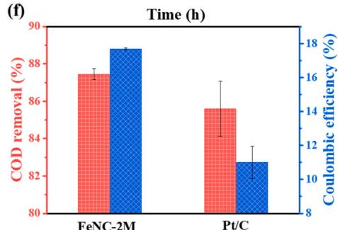

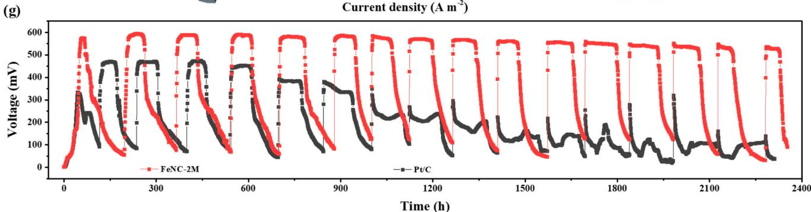  
Fig. 6. (a) Photograph of the open-circuit voltage of FeNC-2 M-based Zn-air battery (ZAB) measured using a multimeter and LED powered by two ZABs in series. (b) Polarization and power density results, (c) discharging curves at $10\mathrm{mA}\mathrm{cm}^{-2}$ for FeNC-2 M and Pt/C-based ZABs. (d) Graphical representation of microbial fuel cell (MFC). (e) Polarization curves and power outputs of FeNC-2 M and Pt/C-based MFC devices. (f) COD removal efficiency and coulombic efficiency. (g) Cell voltage output of MFC devices at a $1000\Omega$ external resistance.

interpreted that the inoculated bacteria needed sufficient time to adapt and reproduce[56]. After the second period, the output voltages of MFCs delivered a steady plateau and changed periodically with the consumption and replacement of the organic substrates. All the voltage platforms of FeNC-2 M-MFC were substantially higher than that of $\mathrm{Pt / C - MFC}$ during the 16 cycles. The FeNC-2 M-MFC obtained a maximal output voltage of $594\mathrm{mV}$ at the 2nd period. Its performance subsequently declined tardily to $529\mathrm{mV}$ at the 16th period, and corresponding voltage attenuation was only $10.9\%$ . For comparison, the maximal voltage of $\mathrm{Pt / C - MFC}$ was $471\mathrm{mV}$ at the 2nd period, which dropped sharply to $108\mathrm{mV}$ at the 16th period with attenuation rate of $77\%$ , attributing to chloride or sulfide poisoning[57,58]. The repeatable voltage platforms illustrated that the FeNC-2 M cathode had high resistance toward poisoning, and displayed the unparalleled stability in MFC operation.

Apart from electricity power generation, the substrate oxidation performance was assessed by monitoring the chemical oxygen demand (COD) removal efficiency. The initial COD concentration for the substrate solution was $4308\mathrm{mgL^{-1}}$ , which consisted of culture medium and domestic effluent with volume ration of 3:1. The average COD removal rate for FeNC-2 M-MFC (Fig. 6f) was up to $87.4\pm 0.3\%$ during the 2nd and 3rd operation phase, surpassing that of control Pt/C-MFC $(85.6\pm 1.5\%)$ . Meanwhile, approximately $17.7\pm 0.1\%$ of coulombic efficiency (CE) was achieved in FeNC-2 M -MFC (Fig. 6f), which showed obvious advantage over the Pt/C-MFC $(11.0\pm 1.0\%)$ . The high COD removal efficiency and CE highlighted the superior degradability of organic substrates and efficient electronic recycling capability, attributing to the good catalytic activity and high conductivity of FeNC-2 M cathode. The high catalytic kinetics of FeNC-2 M along with good biological tolerance could facilitate the efficient electron transport from the microbe to the electrode, thus reducing the electron loss to increase the CE, and accelerating the electricity production and reproduction of microorganisms[59,60]. The respectable catalytic performance of FeNC-2 M cathode pose it as a promising electrocatalyst in MFCs and ZABs. The superiority for FeNC-2 M in energy conversion systems originated from its unique compositional and structural advantages, including the highly active Fe species with atomically dispersed Fe atoms and nanoclusters for boosting the reaction kinetics, reasonable pore structure for enhancing the exposure of catalytic active centers, high graphitization degree for guaranteeing the stability of the metal sites.

# 3. Conclusion

In summary, a general strategy to effectively regulate the electrocatalytic oxygen reduction activity of metal single-atoms sites was demonstrated. The single-atomic Fe catalyst synergistically enhanced by contiguous S atoms and nanometer-sized metal clusters were synthesized via an aggregation-redispersion route, in which Fe was directly bonded with S and immediately adjacent to metal cluster. Due to the near-range interaction, the ambient S atoms and Fe nanoclusters could rationally control the unsymmetrical interface structure of central Fe atoms, resulting in a unique electron configuration. DFT computations disclosed that the synergistic effect of heteroatom and clusters can adequately tune the electronic configurations of single-atom Fe in FeNC-2 M, thus accelerating the desorption of OH* as the RDS and lowering the reaction energy barrier. The dynamic progress of ORR verified the improved reaction kinetics. Benefiting from high activity and accessibility of metal sites, as well as its admirable anticorrosion capability triggered by the graphitized carbon support, the optimal FeNC-2 M catalyst displayed impressive ORR activity and superior durability in wide pH range. Furthermore, FeNC-2 M-based ZABs and MFCs demonstrated a substantial improvement of catalytic performance compared to the benchmark Pt/C catalyst, especially in the cycling stability, elucidating the promising perspective for practical applications. This work shed insight on electron modulation and the performance optimization of

atomic electrocatalysts, which could inspire the exploration of efficient SACs.

# CRediT authorship contribution statement

Lixian Sun: Software, Investigation. Liming WANG: Supervision, Methodology, Funding acquisition. Baitao Li: Writing - review & editing, Supervision, Project administration, Funding acquisition, Conceptualization. Chunfeng Shao: Writing - original draft, Methodology, Investigation, Formal analysis. Jiahui Hua: Investigation. Qiang Li: Methodology, Investigation. Yongpeng Xia: Software, Investigation.

# Declaration of Competing Interest

The authors declare that they have no known competing financial interests or personal relationships that could have appeared to influence the work reported in this paper.

# Data Availability

Data will be made available on request.

# Acknowledgements

This research was supported by the National Natural Science Foundation of China (21872056, U2032152, 52101245, U20A20237, 52371218), Natural Science Foundation of Guangdong Province (2023A1515011249, 2021A1515010149), the Research Fund Program of Guangdong Provincial Key Laboratory of Fuel Cell Technology (FC202208), and the Key Foundation of Educational Commission of Anhui Province (2022AH050376 and KJ2021A0518). The authors also thank the Science Research and Technology Development Project of Guilin (20210102-4), Guangxi Bagui Scholar Foundation and Guilin Lijiang Scholar Foundation. The authors thank BL20U of Shanghai Synchrotron Radiation Facilities (SSRF) for providing the beam time and thank Dr. Fanfei Sun and Dr. Jingyuan Ma.

# Appendix A. Supporting information

Supplementary data associated with this article can be found in the online version at doi:10.1016/j.nanoen.2024.109668.

# References

[1] H.T. Chung, D.A. Cullen, D. Higgins, B.T. Sneed, E.F. Holby, K.L. More, P. Zelenay, Direct atomic-level insight into the active sites of a high-performance PGM-free ORR catalyst, Science 357 (2017) 479-483, https://doi.org/10.1126/science.aan2255.   
[2] G. Bae, M.M. Kim, M.H. Han, J. Cho, D.H. Kim, M.-T. Sougrati, J. Kim, K.-S. Lee, S. H. Joo, W.A. Goddard, H.-S. Oh, H. Kim, F. Jaouen, C.H. Choi, Unravelling the complex causality behind Fe-N-C degradation in fuel cells, Nat. Catal. 6 (2023) 1140-1150, https://doi.org/10.1038/s41929-023-01039-7.   
[3] L. Yan, P. Li, Q. Zhu, A. Kumar, K. Sun, S. Tian, X. Sun, Atomically precise electrocatalysts for oxygen reduction reaction, Chem 9 (2023) 280-342, https://doi.org/10.1016/j.chempr.2023.01.003.   
[4] X.L. Tian, X. Zhao, Y.Q. Su, L.J. Wang, H.M. Wang, D. Dang, B. Chi, H.F. Liu, E.J. M. Hensen, X.W. Lou, B.Y. Xia, Engineering bunched Pt-Ni alloy nanocages for efficient oxygen reduction in practical fuel cells, Science 366 (2019) 850–856, https://doi.org/10.1126/science.aaw7493.   
[5] S.M. Alia, G. Zhang, D. Kisailus, D. Li, S. Gu, K. Jensen, Y. Yan, Porous platinum nanotubes for oxygen reduction and methanol oxidation reactions, Adv. Funct. Mater. 20 (2010) 3742-3746, https://doi.org/10.1002/adfm.201001035.   
[6] K. Sun, J. Dong, H. Sun, X. Wang, J. Fang, Z. Zhuang, S. Tian, X. Sun, $\mathrm{Co(CN)_3}$ catalysts with well-defined coordination structure for the oxygen reduction reaction, Nat. Catal. 6 (2023) 1164-1173, https://doi.org/10.1038/s41929-02301047-7.   
[7] Y. Li, M.-Y. Chen, B.-A. Lu, H.-R. Wu, J.-N. Zhang, Unravelling the role of hydrogen peroxide in pH-dependent ORR performance of Mn-N-C catalysts, Appl. Catal. B 342 (2024) 123458, https://doi.org/10.1016/j.apcatb.2023.123458.   
[8] C. Chen, Y. Wu, X. Li, Y. Ye, Z. Li, Y. Zhou, J. Chen, M. Yang, F. Xie, Y. Jin, C. Jones, N. Wang, H. Meng, S. Chen, Modulating Fe spin state in FeNC catalysts by adjacent Fe atomic clusters to facilitate oxygen reduction reaction in proton exchange

membrane fuel cell, Appl. Catal. B 342 (2024) 123407, https://doi.org/10.1016/j.apcatb.2023.123407.   
[9] B. Singh, M.B. Gawande, A.D. Kute, R.S. Varma, P. Fornasiero, P. McNeice, R. V. Jagadeesh, M. Beller, R. Zboril, Single-atom (Iron-Based) catalysts: synthesis and applications, Chem. Rev. 121 (2021) 13620–13697, https://doi.org/10.1021/acs.chemrev.1c00158.   
[10] Y. Yan, H. Cheng, Z. Qu, R. Yu, F. Liu, Q. Ma, S. Zhao, H. Hu, Y. Cheng, C. Yang, Z. Li, X. Wang, S. Hao, Y. Chen, M. Liu, Recent progress on the synthesis and oxygen reduction applications of Fe-based single-atom and double-atom catalysts, J. Mater. Chem. A 9 (2021) 19489–19507, https://doi.org/10.1039/d1ta02769g.   
[11] C. Shao, L. Wu, Y. Wang, K. Qu, H. Chu, L. Sun, J. Ye, B. Li, X. Wang, Engineering asymmetric Fe coordination centers with hydroxyl adsorption for efficient and durable oxygen reduction catalysis, Appl. Catal. B 316 (2022) 121607, https://doi.org/10.1016/j.apcatb.2022.121607.   
[12] L. Zong, K. Fan, P. Li, F. Lu, B. Li, L. Wang, Promoting oxygen reduction reaction on atomically dispersed Fe sites via establishing hydrogen bonding with the neighboring P atoms, Adv. Energy Mater. 13 (2023) 2203611, https://doi.org/10.1002/aenm.202203611.   
[13] Z. Li, B. Li, Y. Hu, S. Wang, C. Yu, Highly-dispersed and high-metal-density electrocatalysts on carbon supports for the oxygen reduction reaction: from nanoparticles to atomic-level architectures, Mater. Adv. 3 (2022) 779-809, https://doi.org/10.1039/d1ma00858g.   
[14] C. Shao, L. Wu, H. Zhang, Q. Jiang, X. Xu, Y. Wang, S. Zhuang, H. Chu, L. Sun, J. Ye, B. Li, X. Wang, A versatile approach to boost oxygen reduction of Fe-N₄ sites by controllably incorporating sulfur functionality, Adv. Funct. Mater. 31 (2021) 2100833, https://doi.org/10.1002/adfm.202100833.   
[15] Y. Zhou, R. Lu, X. Tao, Z. Qiu, G. Chen, J. Yang, Y. Zhao, X. Feng, K. Mullen, Boosting oxygen electrocatalytic activity of Fe-N-C catalysts by phosphorus incorporation, J. Am. Chem. Soc. 145 (2023) 3647-3655, https://doi.org/10.1021/jacs.2c12933.   
[16] Y. Yan, S. Liang, X. Wang, M. Zhang, S.M. Hao, X. Cui, Z. Li, Z. Lin, Robust wrinkled $\mathrm{MoS}_2 / N$ -C bifunctional electrocatalysts interfaced with single Fe atoms for wearable zinc-air batteries, Proc. Natl. Acad. Sci. 118 (2021) e2110036118, https://doi.org/10.1073/pnas.2110036118.   
[17] K.-M. Zhao, S. Liu, Y.-Y. Li, X. Wei, G. Ye, W. Zhu, Y. Su, J. Wang, H. Liu, Z. He, Z.-Y. Zhou, S.-G. Sun, Insight into the mechanism of axial ligands regulating the catalytic activity of $\mathrm{Fe - N_4}$ sites for oxygen reduction reaction, Adv. Energy Mater. 12 (2022) 2103588, https://doi.org/10.1002/aenm.202103588.   
[18] H. Jin, P. Li, P. Cui, J. Shi, W. Zhou, X. Yu, W. Song, C. Cao, Unprecedentedly high activity and selectivity for hydrogenation of nitroarenes with single atomic $\mathrm{Co}_{1}-\mathrm{N}_{3}\mathrm{P}_{1}$ sites, Nat. Commun. 13 (2022) 723, https://doi.org/10.1038/s41467-022-28367-9.   
[19] L. Yu, Y. Li, Y. Ruan, Dynamic control of sacrificial bond transformation in the Fe-N-C single-atom catalyst for molecular oxygen reduction, Angew. Chem. Int. Ed. 60 (2021) 25296-25301, https://doi.org/10.1002/anie.202111761.   
[20] H. Shang, X. Zhou, J. Dong, A. Li, X. Zhao, Q. Liu, Y. Lin, J. Pei, Z. Li, Z. Jiang, D. Zhou, L. Zheng, Y. Wang, J. Zhou, Z. Yang, R. Cao, R. Sarangi, T. Sun, X. Yang, X. Zheng, W. Yan, Z. Zhuang, J. Li, W. Chen, D. Wang, J. Zhang, Y. Li, Engineering unsymmetrically coordinated $\mathrm{Cu - S_1N_3}$ single atom sites with enhanced oxygen reduction activity, Nat. Commun. 11 (2020) 3049, https://doi.org/10.1038/s41467-020-16848-8.   
[21] Z. Li, Y. Yan, M. Liu, Z. Qu, Y. Yue, T. Mao, S. Zhao, M. Liu, Z. Lin, Robust ringing-opening reaction via asymmetrically coordinated Fe single atoms scaffolded by spoke-like mesoporous carbon nanospheres, Proc. Natl. Acad. Sci. 120 (2023) e2218261120, https://doi.org/10.1073/pnas.2218261120.   
[22] T. Zhang, F. Wang, C. Yang, X. Han, C. Liang, Z. Zhang, Y. Li, A. Han, J. Liu, B. Liu, Boosting ORR performance by single atomic divacancy $\mathrm{Zn - N_3C - C_8}$ sites on ultrathin N-doped carbon nanosheets, Chem. Catal. 2 (2022) 836-852, https://doi.org/10.1016/j.checat.2022.02.006.   
[23] M. Li, Q. Lv, W. Si, Z. Hou, C. Huang, Sp-hybridized nitrogen as new anchoring sites of iron single atoms to boost the oxygen reduction reaction, Angew. Chem. Int. Ed. 61 (2022) e202208238, https://doi.org/10.1002/anie.202208238.   
[24] R. Li, D. Wang, Superiority of dual-atom catalysts in electrocatalysis: one step further than single-atom catalysts, Adv. Energy Mater. 12 (2022) 2103564, https://doi.org/10.1002/aenm.202103564.   
[25] Y. Liu, S. Yuan, C. Sun, C. Wang, X. Liu, Z. Lv, R. Liu, Y. Meng, W. Yang, X. Feng, B. Wang, Optimizing Fe-3d electron delocalization by asymmetric Fe-Cu diatomic configurations for efficient anion exchange membrane fuel cells, Adv. Energy Mater. 202302719 (2023), https://doi.org/10.1002/aenm.202302719.   
[26] H. Huang, D. Yu, F. Hu, S.-C. Huang, J. Song, H.-Y. Chen, L.L. Li, S. Peng, Clusters induced electron redistribution to tune oxygen reduction activity of transition metal single-atom for metal-air batteries, Angew. Chem. Int. Ed. 61 (2022) e202116068, https://doi.org/10.1002/anie.202116068.   
[27] S. Yin, Y.-N. Yan, L. Chen, N. Cheng, X. Cheng, R. Huang, H. Huang, B. Zhang, Y.-X. Jiang, S.-G. Sun, $\mathrm{FeN_4}$ active sites electronically coupled with PtFe alloys for ultralow Pt loading hybrid electrocatalysts in proton exchange membrane fuel cells, ACS Nano 18 (2023) 551-559, https://doi.org/10.1021/acsnano.3c08570.   
[28] X. Wang, L. Xu, C. Li, C. Zhang, H. Yao, R. Xu, P. Cui, X. Zheng, M. Gu, J. Lee, H. Jiang, M. Huang, Developing a class of dual atom materials for multifunctional catalytic reactions, Nat. Commun. 14 (2023) 7210, https://doi.org/10.1038/s41467-023-42756-8.   
[29] W. Zhang, Y. Chao, W. Zhang, J. Zhou, F. Lv, K. Wang, F. Lin, H. Luo, J. Li, M. Tong, E. Wang, S. Guo, Emerging dual-atomic-site catalysts for efficient energy catalysis, Adv. Mater. 33 (2021) 2102576, https://doi.org/10.1002/adma.202102576.

[30] Y. Chen, J. Mao, H. Zhou, L. Xing, S. Qiao, J. Yuan, B. Mei, Z. Wei, S. Zhao, Y. Tang, C. Liu, Coordination shell dependent activity of CuCo diatomic catalysts for oxygen reduction, oxygen evolution, and hydrogen evolution reaction, Adv. Funct. Mater. (2023), https://doi.org/10.1002/adfm.202311664.   
[31] H. Liu, L. Jiang, J. Khan, X. Wang, J. Xiao, H. Zhang, H. Xie, L. Li, S. Wang, L. Han, Decorating single-atomic Mn sites with FeMn clusters to boost oxygen reduction reaction, Angew. Chem. Int. Ed. 62 (2023) e202214988, https://doi.org/10.1002/anie.202214988.   
[32] A. Han, W. Sun, X. Wan, D. Cai, X. Wang, F. Li, J. Shui, D. Wang, Construction of $\mathrm{Co_4}$ atomic clusters to enable $\mathrm{Fe - N_4}$ Motifs with highly active and durable oxygen reduction performance, Angew. Chem. Int. Ed. 62 (2023) e202303185, https://doi.org/10.1002/anie.202303185.   
[33] S.-N. Zhao, J.-K. Li, R. Wang, J. Cai, S.-Q. Zang, Electronically and geometrically modified single-atom Fe sites by adjacent Fe nanoparticles for enhanced oxygen reduction, Adv. Mater. 34 (2022) 2107291, https://doi.org/10.1002/adma.202107291.   
[34] R. Zhao, Y. Wang, G. Ji, J. Zhong, F. Zhang, M. Chen, S. Tong, P. Wang, Z. Wu, B. Han, Z. Liu, Partially nitrided Ni nanoclusters achieve energy-efficient electrocatalytic $\mathrm{CO}_{2}$ reduction to CO at ultralow overpotential, Adv. Mater. 35 (2023) 2205262, https://doi.org/10.1002/adma.202205262.   
[35] X. Wei, S. Song, N. Wu, X. Luo, L. Zheng, L. Jiao, H. Wang, Q. Fang, L. Hu, W. Gu, W. Song, C. Zhu, Synergistically enhanced single-atomic site Fe by Fe3C@C for boosted oxygen reduction in neutral electrolyte, Nano Energy 84 (2021) 105840, https://doi.org/10.1016/j.nanoen.2021.105840.   
[36] S. Zhao, Y. Yang, Z. Tang, Insight into Structural Evolution, Active Sites, and Stability of Heterogeneous Electrocatalysts, Angew. Chem., Int. Ed. 61 (2022) e202110186, https://doi.org/10.1002/anie.202110186.   
[37] C. Tang, H.F. Wang, X. Chen, B.Q. Li, T.Z. Hou, B. Zhang, Q. Zhang, M.M. Titirici, F. Wei, Topological defects in metal-free nanocarbon for oxygen electrocatalysis, Adv. Mater. 28 (2016) 6845-6851, https://doi.org/10.1002/adma.201601406.   
[38] G. Wang, H. Peng, X. Qiao, L. Du, X. Li, T. Shu, S. Liao, Biomass-derived porous heteroatom-doped carbon spheres as a high-performance catalyst for the oxygen reduction reaction, Int. J. Hydrog. Energy 41 (2016) 14101-14110, https://doi.org/10.1016/j.ijhydene.2016.06.023.   
[39] Y. Mun, S. Lee, K. Kim, S. Kim, S. Lee, J.W. Han, J. Lee, Versatile strategy for tuning ORR activity of a single $\mathrm{Fe - N_4}$ site by controlling electron-withdrawing/donating properties of a carbon plane, J. Am. Chem. Soc. 141 (2019) 6254-6262, https:// doi.org/10.1021/jacs.8b13543.   
[40] C. Shao, S. Zhuang, H. Zhang, Q. Jiang, X. Xu, J. Ye, B. Li, X. Wang, Enhancement of mass transport for oxygen reduction reaction using petal-like porous Fe-NC nanosheet, Small 17 (2020) 2006178, https://doi.org/10.1002/smll.202006178.   
[41] C. Shao, L. Wu, Y. Wang, K. Qu, H. Chu, L. Sun, J. Ye, B. Li, X. Wang, An open superstructure of hydrangea-like carbon with highly accessible $\mathrm{Fe - N_4}$ active sites for enhanced oxygen reduction reaction, Chem. Eng. J. 429 (2022) 132307, https://doi.org/10.1016/j.cejj.2021.132307.   
[42] B. Liu, W. Dai, Z. Liang, J. Ye, L. Ouyang, Fe/N/C carbon nanotubes with high nitrogen content as effective non-precious catalyst for oxygen reduction reaction in alkaline medium, Int. J. Hydrog. Energy 42 (2017) 5908–5915, https://doi.org/10.1016/j.ijhydene.2016.12.043.   
[43] H. Wang, F.-X. Yin, N. Liu, R.-H. Kou, X.-B. He, C.-J. Sun, B.-H. Chen, D.-J. Liu, H.-Q. Yin, Engineering Fe-Fe₃C@Fe-N-C active sites and hybrid structures from dual metal-organic frameworks for oxygen reduction reaction in H₂O₂ fuel cell and LiO₂ battery, Adv. Funct. Mater. 29 (2019) 1901531, https://doi.org/10.1002/adfm.201901531.   
[44] K. Yuan, D. Lutzkenkirchen-Hecht, L. Li, L. Shuai, Y. Li, R. Cao, M. Qiu, X. Zhuang, M.K.H. Leung, Y. Chen, U. Scherf, Boosting oxygen reduction of single iron active sites via geometric and electronic engineering: nitrogen and phosphorus dual coordination, J. Am. Chem. Soc. 142 (2020) 2404-2412, https://doi.org/10.1021/jacs.9b11852.   
[45] Y. Zhao, P.V. Kumar, X. Tan, X. Lu, X. Zhu, J. Jiang, J. Pan, S. Xi, H.Y. Yang, Z. Ma, T. Wan, D. Chu, W. Jiang, S.C. Smith, R. Amal, Z. Han, X. Lu, Modulating Pt-O-Pt atomic clusters with isolated cobalt atoms for enhanced hydrogen evolution catalysis, Nat. Commun. 13 (2022) 2430, https://doi.org/10.1038/s41467-022-30155-4.   
[46] A.J. Medford, A. Vojvodic, J.S. Hummelshøj, J. Voss, F. Abild-Pedersen, F. Studt, T. Bligaard, A. Nilsson, J.K. Nørskov, From the Sabatier principle to a predictive theory of transition-metal heterogeneous catalysis, J. Catal. 328 (2015) 36-42, https://doi.org/10.1016/j.jcat.2014.12.033.   
[47] J.K. Nørskov, J. Rossmeisl, A. Logadottir, L. Lindqvist, Origin of the overpotential for oxygen reduction at a fuel-cell cathode, J. Phys. Chem. B 108 (2004) 17886-17892.   
[48] L. Tang, X. Meng, D. Deng, X. Bao, Confinement catalysis with 2D materials for energy conversion, Adv. Mater. 31 (2019) e1901996, https://doi.org/10.1002/adma.201901996.   
[49] L. Gong, H. Zhang, Y. Wang, E. Luo, K. Li, L. Gao, Y. Wang, Z. Wu, Z. Jin, J. Ge, Z. Jiang, C. Liu, W. Xing, Bridge bonded oxygen ligands between approximated $\mathrm{FeN_4}$ sites confer catalysts with high ORR performance, Angew. Chem., Int. Ed. 59 (2020) 13923-13928, https://doi.org/10.1002/anie.202004534.   
[50] H. Meng, B. Wu, D. Zhang, X. Zhu, S. Luo, Y. You, K. Chen, J. Long, J. Zhu, L. Liu, S. Xi, T. Petit, D. Wang, X.-M. Zhang, Z.J. Xu, L. Mai, Optimizing electronic synergy of atomically dispersed dual-metal $\mathrm{Ni - N_4}$ and $\mathrm{Fe - N_4}$ sites with adjacent Fe nanoclusters for high-efficiency oxygen electrocatalysis, Energy Environ. Sci. 17 (2023) 704-716, https://doi.org/10.1039/d3ee03383j.   
[51] S. Mondal, D. Bagchi, M. Riyadh, S. Sarkar, A.K. Singh, C.P. Vinod, S.C. Peter, In situ mechanistic insights for the oxygen reduction reaction in chemically modulated

ordered intermetallic catalyst promoting complete electron transfer, J. Am. Chem. Soc. 144 (2022) 11859-11869, https://doi.org/10.1021/jacs.2c04541.   
[52] G. Kumar, R. Haldar, M. Shanmugam, R.S. Dey, Mechanistic insight into a Co-based metal-organic framework as an efficient oxygen electrocatalyst via an in situ FT-IR study, J. Mater. Chem. A 11 (2023) 26508, https://doi.org/10.1039/d3ta05711a.   
[53] H. Yuan, Y. Hou, I.M. Abu-Reesh, J. Chen, Z. He, Oxygen reduction reaction catalysts used in microbial fuel cells for energy-efficient wastewater treatment: a review, Mater. Horiz. 3 (2016) 382-401, https://doi.org/10.1039/c6mh00093b.   
[54] M. Li, S. Zhou, M. Xu, Graphene oxide supported magnesium oxide as an efficient cathode catalyst for power generation and wastewater treatment in single chamber microbial fuel cells, Chem. Eng. J. 328 (2017) 106-116, https://doi.org/10.1016/j.cej.2017.07.031.   
[55] Y. Xu, S. Zhou, M. Li, Enhanced bioelectricity generation and cathodic oxygen reduction of air breathing microbial fuel cells based on $\mathrm{MoS}_2$ decorated carbon nanotube, Int. J. Hydrog. Energy 44 (2019) 13875-13884, https://doi.org/10.1016/j.ijhydene.2019.04.040.   
[56] Y. Du, F. Ma, C. Xu, J. Yu, D. Li, Y. Feng, L. Zhen, Nitrogen-doped carbon nanotubes/reduced graphene oxide nanosheet hybrids towards enhanced cathodic oxygen reduction and power generation of microbial fuel cells, Nano Energy 61 (2019) 533-539, https://doi.org/10.1016/j.nanoen.2019.05.001.   
[57] S. Gupta, A. Patro, Y. Mittal, S. Dwivedi, P. Saket, R. Panja, T. Saeed, F. Martinez, A.K. Yadav, The race between classical microbial fuel cells, sediment-microbial fuel cells, plant-microbial fuel cells, and constructed wetlands-microbial fuel cells: Applications and technology readiness level, Sci. Total Environ. 879 (2023) 162757, https://doi.org/10.1016/j.scitotenv.2023.162757.   
[58] J. Chen, Y. Hu, W. Huang, L. Zhang, Enhanced electricity generation for biocathode microbial fuel cell by in situ microbial-induced reduction of graphene oxide and polarity reversion, Int. J. Hydrog. Energy 42 (2017) 12574-12582, https://doi.org/10.1016/j.ijhydene.2017.03.012.   
[59] X. Wang, Z. Kong, J. Ye, C. Shao, B. Li, Hollow nitrogen-doped carbon nanospheres as cathode catalysts to enhance oxygen reduction reaction in microbial fuel cells treating wastewater, Environ. Res. 201 (2021) 111603, https://doi.org/10.1016/j.envres.2021.111603.   
[60] B. Li, Z. He, M. Wang, X. Wang, PtSnP/C and PtSn/C as efficient cathode catalysts for oxygen reduction reaction in microbial fuel cells, Int. J. Hydrog. Energy 42 (2017) 5261-5271, https://doi.org/10.1016/j.ijhydene.2017.01.087.

Chunfeng Shao received her Ph.D. from South China University of Technology in 2021. She is now a lecturer in Huaibei Normal University. Her research interest is focused on the rational design and controllable synthesis of atomic-scale materials for applications in energy storage and catalysis.

Jiahui Hua received his B.S. degree from Huaibei Normal University in Materials Physics. Now he is a master degree candidate in material science and engineering from Huaibei Normal University. His current research interest is electrocatalytic $\mathrm{CO}_{2}$ reduction.

Qiang Li received his Ph.D. from Shanghai Jiao Tong University in 2017. He is now an associate professor in Huaibei Normal University. His research interest is focused on nanoscaled materials and their application in photocatalysis, photoelectrocatalysis and environmental remediation.

Yongpeng Xia received his Ph.D. from Guilin University of Electronic Technology in 2020. Currently he is an associate professor in School of Materials Science and Engineering, Guilin University of Electronic Technology. His research interests focus on new materials for energy storage and conversion, especially hydrogen storage materials, phase-change materials, nano-structured catalytic materials, thermochemistry, and thermal management.

  
chemistry, and sensors.

Lixian Sun is a professor at the Guilin University of Electronic Technology of China. He worked at Dalian Institute of Chemical Physics, Chinese Academy of Sciences from 2001 to 2012 as a Professor. He received his Bachelors from Hunan University in 1984, MSc in 1987 and PhD in 1994. He was elected as the Foreign Member of Russian Academy of Natural Sciences (RAEN), Foreign Member of European Academy of Sciences (EurAsc), and Fellow of Royal Society of Chemistry (FRSC). He got a fellowship from the Humboldt Foundation from 1995 to 1996. He held the NEDO, STA, and AIST fellowships at National Institute of AIST Tsukuba Center (Japan) from 1996 to 2001. He is currently focusing on research in energy storage, especially hydrogen storage materials, biofuel cells, thermo

Liming Wang is a professor of Chemistry at South China University of Technology (SCUT). He received his Bachelor degree from Fudan University in 1991, Master of Science from Dalian Institute of Chemical Physics in 1994, and PhD in 2002 from University of California, Riverside. After post-doc at Emory University and Leeds University, he joined SCUT in 2005. His research focuses on the atmospheric oxidation mechanism of volatile organic compounds, the photochemical degradation of emerging pollutants, and energy storage by sodium-ion battery.

Baitao Li received her Bachelor degree and Master degree of Science from Northeast Normal University in 1991 and 1994, PhD degree in Engineering from University of Tokyo in 2003. She carried out her postdoctoral research in the laboratory of Professor Keiichi Tomishige at University of Tsukuba before she took up her current position as a Professor of Chemistry at South China University of Technology in 2006. Her current research interests include the functional materials, natural gas reforming, fuel cell, and electrochemistry.